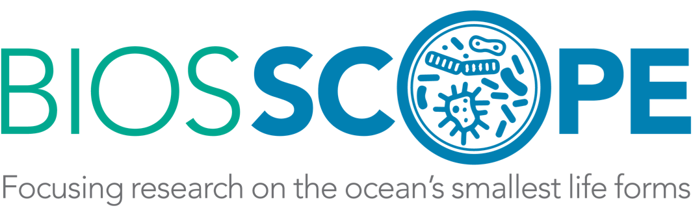

  

  
  
  

---

# **🌊 Brett D. Jameson, PhD**  
### *Microbial Oceanographer & Marine Biogeochemist*  
**Bermuda Institute of Ocean Sciences (BIOS) • BIOS-SCOPE Program**

I am a **microbial oceanographer** studying how environmental variability and climate-driven disturbances reshape **microbial community structure**, **metabolic networks**, and **biogeochemical cycles**. My work focuses on how microbial processes scale from **genes → metabolism → communities → ecosystems**, and how these invisible interactions influence the global state of the oceans and atmosphere.

---

## **🔬 Research Themes**

- 🧬 **Microbial community dynamics**  
  Environmental drivers of microbial composition, traits, and interactions.

- 🔗 **Metabolic networks & carbon flow**  
  Dark carbon fixation, organic matter transformations, and emergent metabolic organization.

- 🌍 **Biogeochemical cycling**  
  Microbial controls on carbon, nitrogen, and greenhouse gas transformations.

- 🌡️ **Climate perturbations in marine ecosystems**  
  Heatwaves, oxygen loss, and chemical variability shaping microbial responses.

- 🧠 **Multi-omics integration & ecosystem modeling**  
  Genome-resolved metagenomics, metatranscriptomics, SIP, and network analysis.

---

## **🌐 Current Position — BIOS-SCOPE Postdoctoral Scientist**

I work with **BIOS-SCOPE**, a multi-institutional program investigating microbial oceanography in the **North Atlantic**, with long-term fieldwork centered at the **Bermuda Atlantic Time-series Study (BATS)**.

### **🔭 BIOS-SCOPE integrates:**
- Long-term ocean observing programs  
- Genome-resolved metagenomics & transcriptomics  
- Stable-isotope probing (DNA- & RNA-SIP)  
- Biogeochemical rate measurements  
- Systems ecology & network-based approaches  

Within this framework, I use multi-omics and SIP incubations to:

- Identify **dark carbon-fixing microbes**  
- Map **microbial interaction networks** in the mesopelagic  
- Quantify **carbon and energy flow**  
- Understand how microbial communities respond to **climate variability**

---

## **🌎 Research Across Marine Ecosystems**

My work spans diverse marine environments connected by strong geochemical gradients:

- 🌊 Mesopelagic open ocean
- 🫧 Oxygen-deficient zones
- 🪸 Coral reefs
- 🪨 Coastal & continental margin sediments      

Across systems, my goal is to understand how the invisible majority of life in the ocean **structures ecosystems** and **shapes Earth’s climate trajectory**.

---

## **🛠️ Tools, Skills & Approaches**

- **Multi-omics:** metagenomics, metatranscriptomics, DNA/RNA-SIP  
- **Biogeochemistry:** microsensors, stable isotope experiments, flux modeling  
- **Computing:** R, Python, Bash, Snakemake, HPC workflows  
- **Networks & Systems Biology:** microbial interactions, functional trait inference  

---

Thanks for visiting — feel free to explore my repositories for workflows, analysis tools, and ongoing microbial oceanography research 🌊  
